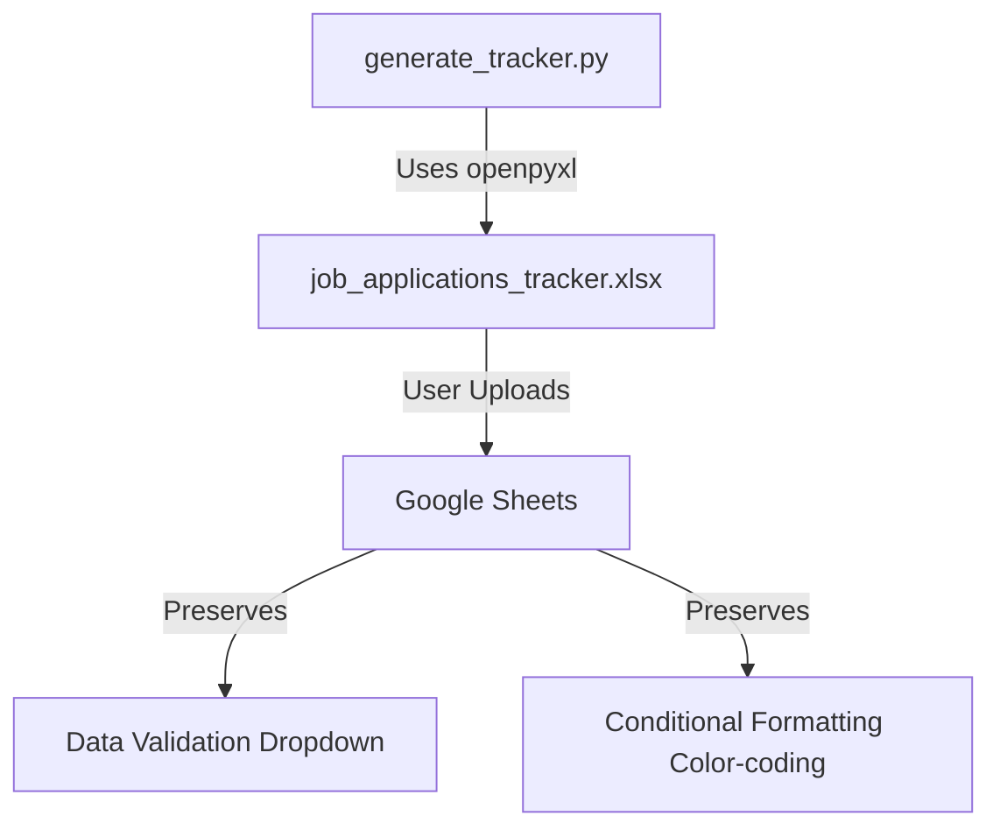
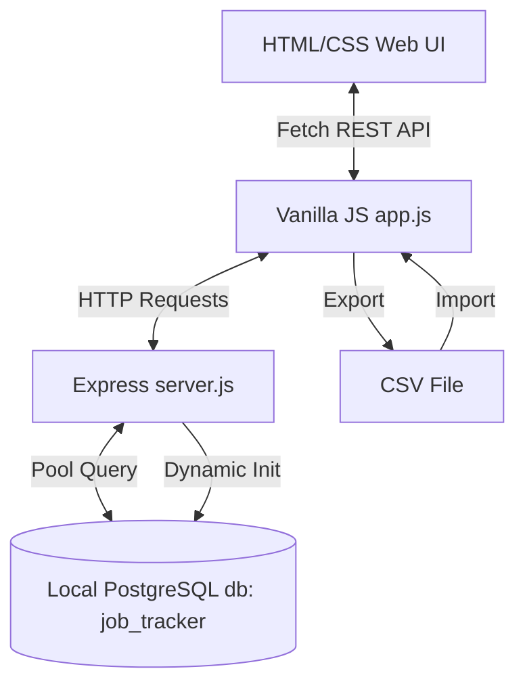

# System Architecture - LinkedIn Job Application Tracker

This project consists of two distinct components designed to manage job application details.

## Core Data Schema

The database structure is shared between the Excel spreadsheet and the Web Tracker to ensure seamless import/export:

| Field Name | Type | Description | Values / Formatting |
|---|---|---|---|
| Company | Text / VARCHAR | Name of the hiring organization | Required |
| Job Title | Text / VARCHAR | Title of the position | Required |
| Status | Dropdown / VARCHAR | Current state of the application | Wishlist, Applied, Interviewing, Offered, Rejected |
| Date Applied | Date / VARCHAR | Date when the application was sent | YYYY-MM-DD format |
| Job Description | Text / TEXT | Detailed description of the job posting | Text |
| Job Link | Text / TEXT | URL link back to the job posting | Text / Hyperlink |
| Contact Person | Text / VARCHAR | Recruiter or hiring manager info | Optional |
| Notes / Next Steps | Text / TEXT | General remarks, interview notes, etc. | Optional |

---

## 1. Spreadsheet Template Component (`generate_tracker.py`)

A standalone Python CLI utility utilizing the `openpyxl` library to programmatically compile a workbook containing pre-configured layouts, formatting rules, and validation cells.



- **Openpyxl** builds the sheet structure.
- **Data Validation Rule**: Configures status dropdown choices (`FormulaRule` in `openpyxl.worksheet.datavalidation`).
- **Conditional Formatting**: Applies fill colors based on cells equaling specific string statuses.

---

## 2. Interactive Web Application Tracker Component

A full-stack client-server application hosted locally.



- **Database Layer**: A local PostgreSQL database (`job_tracker`) running on macOS.
- **Dynamic Initialization**: On server start, `server.js` connects to the pool and programmatically executes a query to create the table structure:
  ```sql
  CREATE TABLE IF NOT EXISTS jobs (...);
  ```
- **Backend API Layer**: Node.js/Express server exposing endpoints:
  - `GET /api/jobs`
  - `POST /api/jobs`
  - `PUT /api/jobs/:id`
  - `DELETE /api/jobs/:id`
  - `POST /api/jobs/import`
- **Frontend Layer**: Pure responsive CSS Grid / Flexbox matching dark and light neon glassmorphic aesthetics.
- **Data Sync**: CSV parser/generator logic to output or ingest rows compatible with Google Sheets imports, calling bulk API imports.
